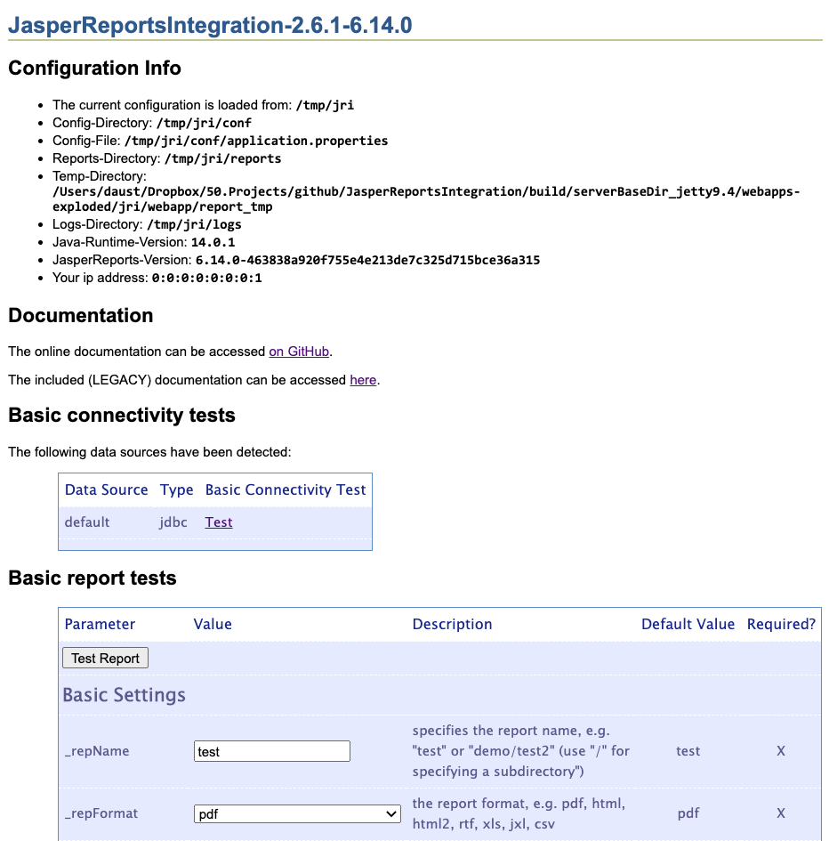
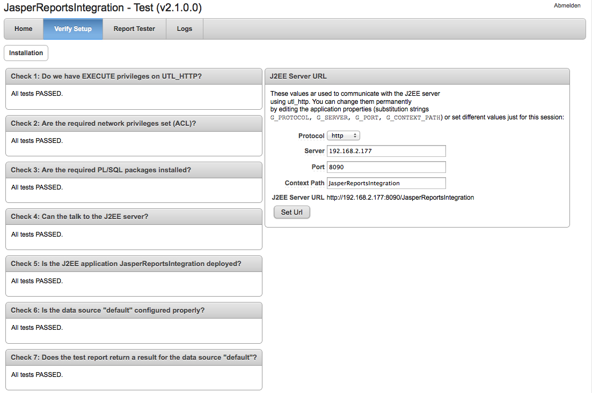
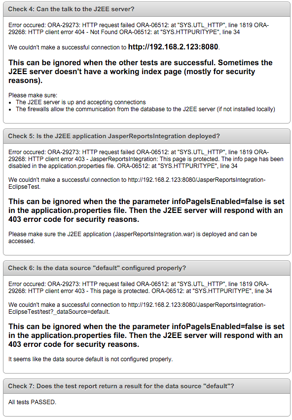

## <a name="install.installation"></a>Installation

1. [Download the files](#install.installation.download)
2. [Installation in the J2EE server](#install.installation.installJ2EE)
3. [Installation of database objects](#install.installation.installDB)
4. [Installation of the test application](#install.installation.apex)

### <a name="install.installation.download"></a>1. Download the files

You can download the files from [here](https://github.com/daust/JasperReportsIntegration/releases) and unzip them.

### <a name="install.installation.installJ2EE"></a>2. Installation in the J2EE server

We need to install the J2EE application and configure the data sources in this step. The J2EE application has to find various configuration files (e.g. ``conf/application.properties``, ``conf/log4j2.xml``) and also the different reports that we can run (e.g. ``reports/test.jasper``).

It is recommended practice to separate the configuration-/report files from the J2EE application itself. In the early versions of the JasperReportsIntegration all reports were placed directly in the web application itself, for example into the directory ``$TOMCAT_HOME/webapps/reports``. In order to easily upgrade your installation in the future it is recommended to put the configuration and report files into a separate directory and not store them inside of the J2EE application.

Anyhow the J2EE application must be able to locate these files.

We have two options here:

1. [Configure the server environment using an operating system environment variable](#install.installation.installJ2EE.1)

2. [Configure the setting in the web.xml file of the ``jri.war`` file](#install.installation.installJ2EE.2)

The difference comes into play when you deploy the ``jri.war`` file multiple times on the same J2EE server or on different J2EE servers on the same machine. When using the operating system environment variable, all instances of the JasperReportsIntegration will use the same configuration and reports.

If you want to use different configurations for your different instances on the same machine (either you deploy different version of the JasperReportsIntegration or you have your development, test and production environment running on the same machine but on different J2EE servers), you would use the direct manipulation of the ``web.xml`` file.

### <a name="install.installation.installJ2EE.1"></a>2.1. Configure the server environment using an operating system environment variable

Using the operating system environment variable ``OC_JASPER_CONFIG_HOME`` we can configure where these files reside on the filesystem. This directory is the same as the base directory of your downloaded files, i.e. it should at least contain the subdirectories conf, reports, logs.

#### 2.1.1 Create the required directory structure

First you need to set up the required directory structure in the target directory. Just copy the directories ``conf``, ``reports`` and ``logs`` to the target directory, e.g. ``c:\app\JasperReportsIntegration``:

</img>

#### 2.1.2.a) Unix / Linux: set the environment variable

On a Unix / Linux system running Tomcat you could for example add this setting to the Tomcat startup script (e.g. ``/usr/local/tomcat/bin/startup.sh``):

```
OC_JASPER_CONFIG_HOME=/opt/JasperReportsIntegration
export OC_JASPER_CONFIG_HOME
```

#### 2.1.2.b) Windows: set the environment variable

On a Windows machine you could do the same (e.g. ``c:\program files\apache tomcat\bin\startup.cmd``):

```
SET OC_JASPER_CONFIG_HOME=c:\app\JasperReportsIntegration

or you could modify the system environment of the machine and create the variable 

OC_JASPER_CONFIG_HOME=c:\app\JasperReportsIntegration
```

### <a name="install.installation.installJ2EE.2"></a>2.2 Configure the setting in the ``web.xml`` file of the ``jri.war`` file

By using this approach you can tell the ``jri.war`` file directly where it can find its configuration files. The following procedure will manipulate the J2EE context-parameter ``oc.jasper.config.home`` in the file ``web.xml`` of the ``jri.war`` directly for you.

#### 2.2.1 Create the required directory structure

First you need to set up the required directory structure in the target directory. Just copy the directories ``conf``, ``reports`` and ``logs`` to the target directory, e.g. ``c:\app\JasperReportsIntegration``:

</img>

#### 2.2.2.a) Unix / Linux:  Set the configuration directory directly in the ``jri.war`` file

In the following example we will use ``/opt/JasperReportsIntegration`` as the target directory.
```
cd bin
./setConfigDir.sh ../webapp/jri.war /opt/JasperReportsIntegration
```

#### 2.2.2.b) Windows:  Set the configuration directory directly in the ``jri.war`` file

In the following example we will use ``c:\app\JasperReportsIntegration`` as the target directory.
```
cd bin
setConfigDir.cmd ..\webapp\jri.war c:\app\JasperReportsIntegration
```

#### 2.2.3.a) Unix / Linux: Get the configuration directory from the ``jri.war`` file

In order to determine the configuration directory from a specific ``jri.war`` file, you can run the following command to see where it points to. This is just for verification purposes.
```
cd bin
./getConfigDir.sh ../webapp/jri.war
```

#### 2.2.3.b) Windows: Get the configuration directory from the jri.war file

In order to determine the configuration directory from a specific ``jri.war`` file, you can run the following command to see where it points to. This is just for verification purposes.
```
cd bin
getConfigDir.cmd ..\webapp\jri.war
```

### 2.3 Configure your database access

Edit the file ``conf/application.properties`` and configure the data source ``default`` to connect to your Oracle schema (change the parts in bold to point to the Oracle schema you want to connect to):

<pre>
#====================================================================
# JDBC datasource configuration
# http://www.orafaq.com/wiki/JDBC#Thin_driver
#====================================================================
[datasource:default]
url=jdbc:oracle:thin:<b>@192.168.2.114:1521:XE</b>
username=<b>HR</b>
password=<b>hr_password</b>
</pre>

You can also connect to your Oracle Cloud database:

<pre>
#====================================================================
# JDBC datasource configuration
# http://www.orafaq.com/wiki/JDBC#Thin_driver
#====================================================================
[datasource:default]
url=jdbc:oracle:thin:<b>@tnsnames_entry?TNS_ADMIN=/path/to/wallet</b>
username=<b>HR</b>
password=<b>hr_password</b>
</pre>

On Windows you might have to use ``/`` instead of ``\`` when you experience connection errors (see for details: https://github.com/daust/JasperReportsIntegration/issues/68), e.g.: 
```
url=jdbc:oracle:thin:<b>@tnsnames_entry?TNS_ADMIN=c:/path/to/wallet</b>
```

Alternatively you could use the native JNDI data source of your application server. See the documentation there on how to configure it. In this configuration file you would have to register just the JNDI datasource you want to use:

<pre>
#====================================================================
# Native JNDI datasource, to be configured in the application server
# name: jndi_test
#====================================================================
[datasource:<b>jndi_test</b>]
type=<b>jndi</b>
name=<b>jndi_test</b>
</pre>

In order to use JDNI datasources (not only Oracle but any jdbc datasource that is supported by Tomcat), you need to configure the file ``$CATALINA_BASE/conf/[enginename]/[hostname]/jri.xml``. In most cases this will be ``$CATALINA_BASE/conf/Catalina/localhost/jri.xml``. The .xml file has the same name as the .war file. In our case this is jri.war and thus jri.xml. But if you change the name of the .war file the config file name will be different as well. 

Here is an example of a proper ``jri.xml`` file: 
```
<?xml version="1.0" encoding="UTF-8"?>
<!DOCTYPE xml>
<Context debug="0" reloadable="false" crossContext="true">

    <!-- default data source, when no _dataSource parameter is given -->
    <!-- parameter definition: http://commons.apache.org/dbcp/configuration.html -->
    <!-- minimum connections in pool: 3 -->
    <!-- check valid session: each 5 minutes  -->

    <Resource name="jdbc/jndi_test" auth="Container" type="javax.sql.DataSource"
              driverClassName="oracle.jdbc.OracleDriver"
              maxActive="20" maxIdle="10" maxWait="-1"
              initialSize="4" minIdle="3" validationQuery="select user from dual"
              testWhileIdle="true" testOnBorrow="true" timeBetweenEvictionRunsMillis="300000"
              numTestsPerEvictionRun="100" minEvictableIdleTimeMillis="10000"

              url="jdbc:oracle:thin:@127.0.0.1:1521:XE" 
              username="user"
              password="pwd" 
              />
                        
</Context>
```
In the resource definition you need to prefix your datasource name with ``"jdbc/"``, but you access it without it. 


### 2.4 Encrypting all passwords in the ``application.properties`` file

You can optionally encrypt the passwords in the ``application.properties`` file. Just follow the following steps, the file will automatically be updated with the encrypted passwords for all of the datasources.

#### 2.4.1.a) Unix / Linux

In order to determine the configuration directory from a specific ``jri.war`` file, you can run the following command to see where it points to. This is just for verification purposes.
```
cd bin
./encryptPasswords.sh <path to application.properties file>
  e.g.: ./encryptPasswords.sh /opt/JasperReportsIntegration/conf/application.properties
```

#### 2.4.1.b) Windows

In order to determine the configuration directory from a specific ``jri.war`` file, you can run the following command to see where it points to. This is just for verification purposes.
```
cd bin
encryptPasswords.cmd <path to application.properties file>
  e.g.: encryptPasswords.cmd c:\app\JasperReportsIntegration\conf\application.properties
```

### 2.5 Setting the reports path

By default, all reports will be found in the directory ``OC_JASPER_CONFIG_HOME/reports``, i.e. a subdirectory to the main configuration home. 

But you can define a list of locations of where reports will be searched for. 

```
# report definition files will be looked up in the following order as
#   specified by the reportsPath, e.g.: 
#     Linux/macOS: reportsPath=../reports,/path/to/reports1,/path/to/reports2,/path/to/reports3
#     Windows: reportsPath=..\\reports,c:\\path\\to\\reports1,c:\\path\\to\\reports2,c:\\path\\to\\reports3
#
#   Each entry is separated by a "," !!!
#
#   If the reportsPath is left empty or not defined, then the default is "../reports" (*nix) or
#      "..\\reports" (windows) respectively, will start from the location of the application.properties (this)
#      file
reportsPath=
```
This is an example for Linux: 
```
reportsPath=/tmp/jri/reports,../reports,/tmp/reports
```

### 2.6 Configure Apache Tomcat

#### Configure Memory Settings

You can configure the Java environment for Apache Tomcat and set specific startup parameters for the Java VM. See https://www.xwiki.org/xwiki/bin/view/Documentation/AdminGuide/Installation/InstallationWAR/InstallationTomcat/ for details. 

Example for Windows: 
- create ``setenv.bat`` file in ``%TOMCAT_HOME%\bin`` directory: 
```
set JAVA_OPTS=%JAVA_OPTS% -Djava.awt.headless=true -server -Xms2048m -Xms2048m -XX:MaxPermSize=192m
```

Example for *nix: 
- create ``setenv.sh`` file in ``%TOMCAT_HOME%/bin`` directory: 
```
#!/bin/sh
export JAVA_OPTS="${JAVA_OPTS} -Djava.awt.headless=true -server -Xms2048m -Xms2048m -XX:MaxPermSize=192m"
```

#### Configure JNDI Data Sources

In order to use JDNI Data Sources, it is recommended to configure your host in the Tomcat ``server.xml`` file like this: 
```
      <Host appBase="webapps" autoDeploy="true" name="localhost" unpackWARs="true"
          deployXML="true" copyXML="true">
```
* autoDeploy: .war files in the directory webapps will be deployed automatically
* unpackWARs: .war files will be automatically "unzipped" and the deployment directory will be created (exploded)
* deployXML: any JNDI data sources defined in jri.war/META-INF/context.xml will be used, else ignored
* copyXML: the template file from jri.war/META-INF/context.xml will be copied into the local Tomcat configuration directory $TOMCAT_HOME/conf/Catalina/localhost/

**Those settings are sometimes disallowed by your administrator for security reasons, so please check with your admin.**


### 2.7 Deploy the J2EE application

Take the application server of your choice and deploy the file ``webapp/jri.war`` to it. For an Apache Tomcat this typically means to copy the file ``jri.war`` into the directory ``webapps`` of your Tomcat application. If the Tomcat doesn't deploy it automatically, you would have to restart the Tomcat.

After that you can reach the JasperReportsIntegration homepage with the URL ``http://<server>:<port>/jri``.

Here you will find the included documentation, information about the location of the configuration files, you can test the database connections and run the test reports:

</img>


### 2.8 Securing the homepage of the J2EE application

Since the homepage tells you a lot about the system you will typically protect that information in a production environment.
Therefore you can edit the file ``conf/application.properties`` and set the config parameter ``infoPageIsEnabled=false``.

<pre>
#====================================================================
# Application properties (global)
#====================================================================
[application]
configFileVersion=2.8.0
jndiPrefix=java:comp/env/jdbc/
# infoPageIsEnabled will show the initial start page of the j2ee application
# including testing and the environment settings
<b>infoPageIsEnabled=false</b>
</pre>

After you restart the J2EE application the homepage will be protected:

</img>

### 2.9 Displaying Error Messages

For security reasons, we don't display any error messages. This is a secure setting for production systems. 

For development systems you typically want to display the error messages in the browser to quickly troubleshoot the situation. 
Therefore you can edit the file ``conf/application.properties`` and set the config parameter ``printDebugToScreen=true``.

<pre>
#====================================================================
# Application properties (global)
#====================================================================
[application]
<b>printDebugToScreen=true</b>
</pre>


### <a name="install.installation.installDB"></a>3. Installation of database objects

Now that we have the J2EE application working, we can install the PL/SQL API in the database. The database objects required for the integration will be installed into each application schema that you want to use with the integration. 
The installation instructions will refer to the application schema (in which you install the software) as ``[application schema]``. The password for the application schema will be referred to as ``[application schema password]``.

Thus when I use an instruction like ``sqlplus [application schema]/[application schema password]@[database]`` please replace that with the actual values of your local installation. For example, if you want to install the integration kit into the schema ``HR`` with the password ``hr1`` into your local XE instance (having a TNS entry named ``xe``) then this instruction translates to:
```
sqlplus hr/hr1@xe
```

### 3.1 Database installation (SYS)

First of all we need to grant the required privileges to the Oracle user who will own the packages for the integration.

1. Extract the downloaded zip file.
2. Open a command shell:
    * e.g. on Windows: ``Start > Execute : cmd``

3. Go to the subdirectory sql (of where you extracted the file):
```
cd sql
```

4. Connect as SYS to the local instance (using sqlplus)
```
sqlplus "sys/[sys password]@[database] as sysdba"
```

5. Run the installation script (and pass the name of the target application schema as a parameter)
```
@sys_install.sql [application schema]
```

6. [optional] If you are installing on an Oracle Release 11.0 and higher, you have to grant the required network privileges to the application schema. 
    * For 11g use: 
        ```
        @sys_install_acl_11g.sql [application schema] [server name]
        ```
        e.g. (installing into schema SCOTT and calling url http://localhost:8080/jri)
        ```
        @sys_install_acl_11g.sql SCOTT localhost
        ```
    * For 12c and above use: 
        ```
        @sys_install_acl_12_and_above.sql [application schema] [server name]
        ```
        e.g. (installing into schema SCOTT and calling url http://localhost:8080/jri)
        ```
        @sys_install_acl_12_and_above.sql SCOTT localhost
        ```

### 3.2 Database installation (Application Schema)

1. Open a command shell:
    * e.g. on Windows: ``Start > Execute : cmd``

2. Go to the subdirectory sql (of where you extracted the file):
```
cd sql
```

3. Change encoding to Unicode for the sql files
```
On Windows: set NLS_LANG=AMERICAN_AMERICA.AL32UTF8
On Linux/Unix: export NLS_LANG=AMERICAN_AMERICA.AL32UTF8
```

4. Connect as the application schema to the local instance (using sqlplus)
```
sqlplus [application schema]/[application schema password]@[database]
```

5. Run the installation script
```
@user_install.sql
```

### <a name="install.installation.apex"></a>4. Installation of the test application

The test application will allow for basic testing of the integration with all relevant parts. Install the application file ``apex\[apex version]\f201_JasperReportsIntegration-Test_[version].sql`` into your workspace. 

Please always pick the highest APEX version, e.g. when running APEX 19.1 and above (19.2, 20.1, ...), please install ``apex\APEX 19.1\f201_JasperReportsIntegration-Test_2.6.1.sql``.

It will perform checks on the installation and allow you to run the test reports.

</img>

In some circumstances you can encounter errors, mostly due to enhanced security constraints:
Expected errors during validation

</img>

* Check 4 can fail when there is no valid index page for the J2EE container
* Check 5 and Check 6 can fail, when the setting infoPageIsEnabled=false in the application.properties file is set
* Check 7 should be always be working correctly.

